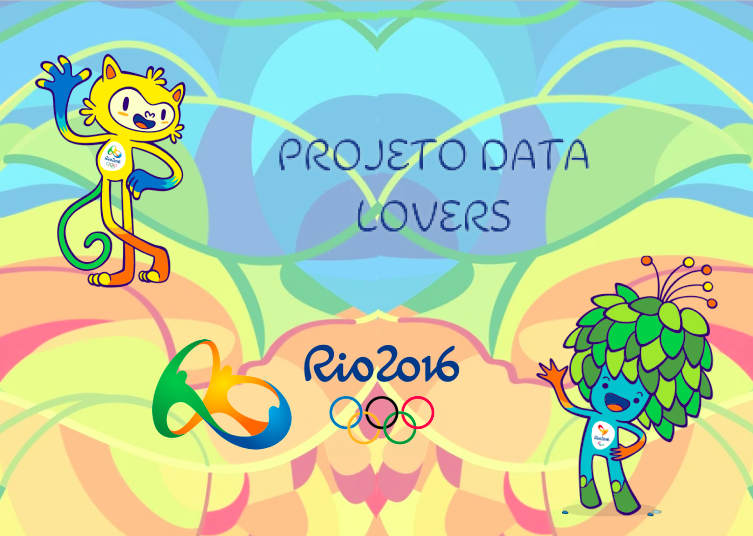
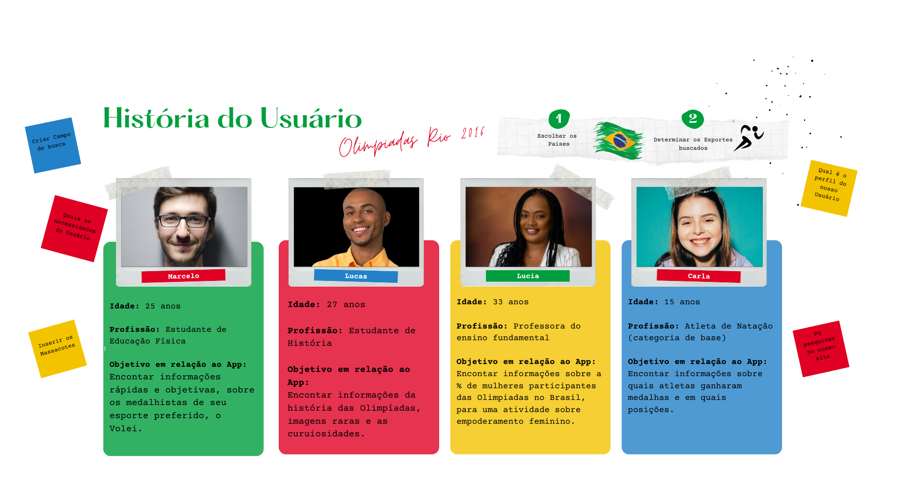
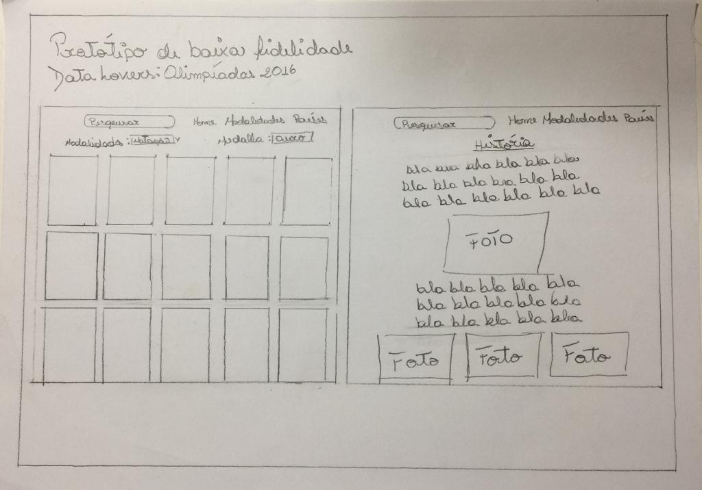
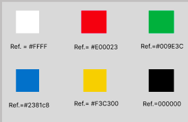
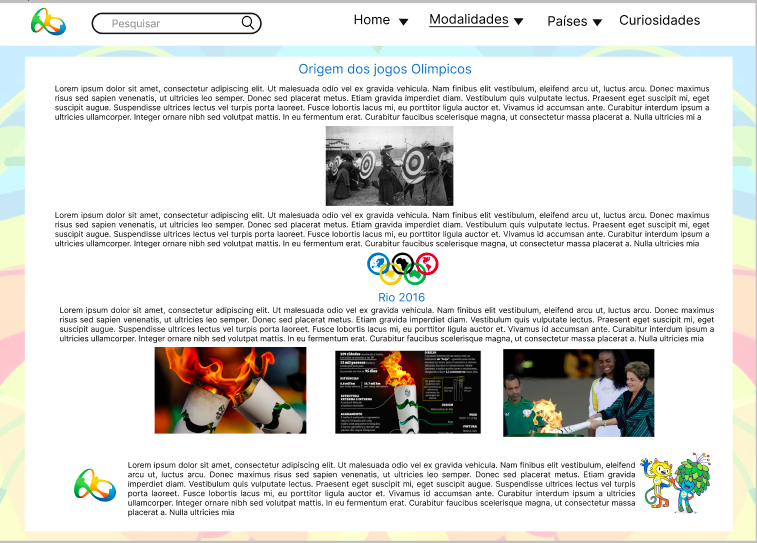
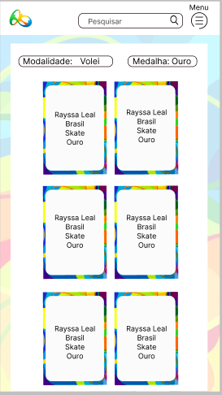
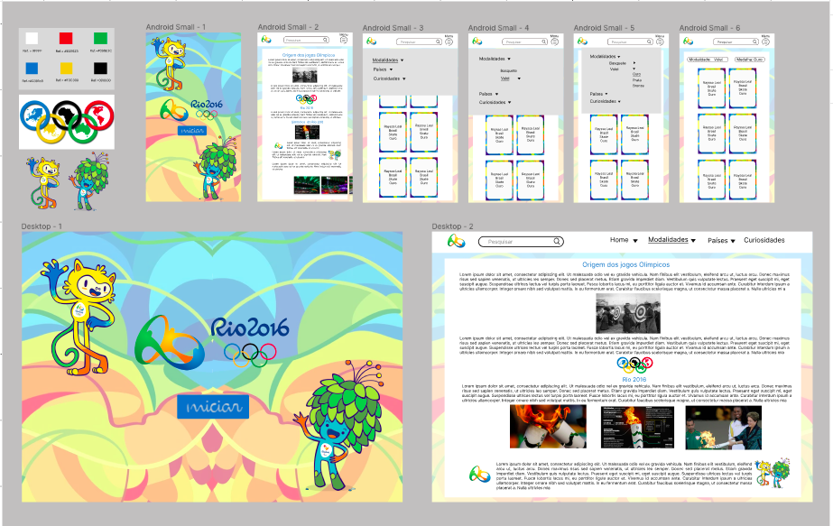
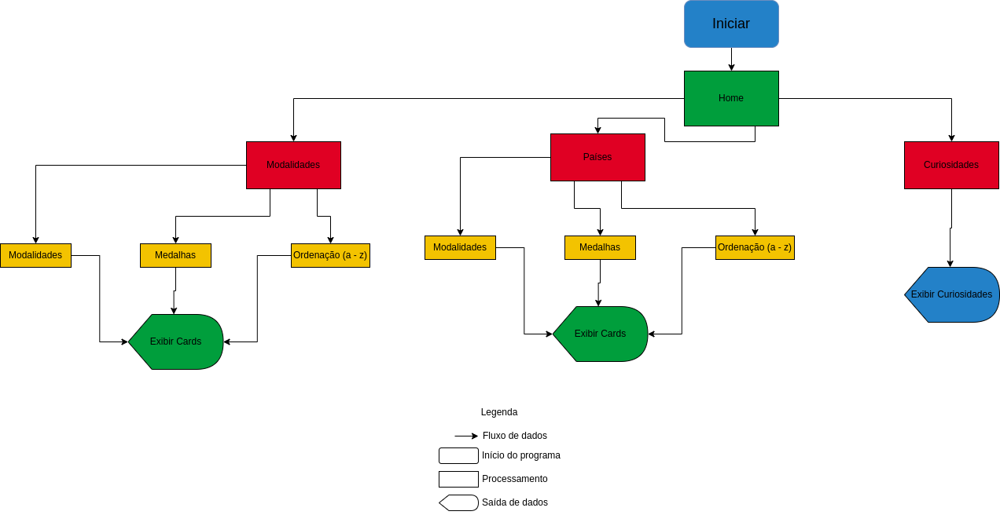
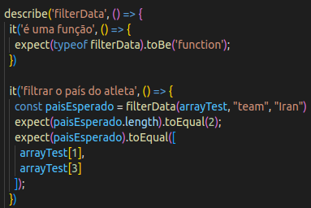

#  Olimpíadas Data Lovers

### Link do projeto em funcionamento: https://adevcarol.github.io/SAP008-data-lovers/src/index.html

##  Índice

- [Olimpíadas Data Lovers](#olimpíadas-data-lovers)
  - [Índice](#índice)
  - [1. Introdução :](#1-introdução-)
  - [2. Concepção do Produto e Usabilidade:](#2-concepção-do-produto-e-usabilidade)
  - [3. História do Usuário:](#3-história-do-usuário)
  - [4. Protótipo de Baixa Fidelidade:](#4-protótipo-de-baixa-fidelidade)
  - [5. Teste de Usabilidade:](#5-teste-de-usabilidade)
    - [Fluxograma](#fluxograma)
  - [6. Demonstração da Aplicação:](#6-demonstração-da-aplicação)
  - [7. Considerações Técnicas e Execução:](#7-considerações-técnicas-e-execução)
    - [HTML](#html)
    - [CSS](#css)
    - [JavaScript](#javascript)
  - [8. Autoras:](#8-autoras)

***
 

 

 Data Lovers: Tema escolhido "Olimpíadas Rio 2016"
 

##  1. Introdução : 

Jogos Olímpicos de 2016 conhecidos oficialmente como os Jogos da XXXI Olimpíada, mais comumente Rio 2016, foi um evento multiesportivo realizado no segundo semestre de 2016, na cidade do Rio de Janeiro, capital do estado homônimo, no Brasil.

Este projeto teve como base, o banco de dados dos medallhistas dos Jogos Olímpicos do Rio de Janeiro 2016.

Foi idealizado para ser uma aplicação Web, que busca atender amantes dos esportes olímpicos (atletas amadores e altetas em ascenção); estudantes, historiadores  e professores.

##  2. Concepção do Produto e Usabilidade: 

Inicíamos o projeto com uma pesquisa histórica, sobre o início das olimpíadas, onde reunimos relatos para traçar um parelelo desde  a primeira edição dos Jogos da Era Moderda (1.896), até a Rio 2016.

Pensamos em uma aplicação intuitiva, rápida e prática, que englobasse informações históricas e atuais, sobre o contexto dos jogos. Conteúdos sobre os atletas, modalidades, países participantes e curiosidades. 

Desde as etapas iniciais, priorizamos tornar a aplicação acessível para todos os usuários:

* Fontes grandes e legíveis;
* Efeito de Zoom nas imagens;
* Botão em comum para o retorno a página ínicial.
* Uso estratégico das cores primarias (auto contraste);
* Tela responsiva;

##  3. História do Usuário: 
Criamos quatro histórias para elucidar os usuários em potencial e entender o fluxo do interações que os mesmos, possam executar. 

 

 
##  4. Protótipo de Baixa Fidelidade: 
A Interface conta com uma barra de navegabilidade na parte superior, onde se encontram a logo das olimpíadas, o campo de pesquisa dos cards e os links para transição entre páginas.

Idealizamos inicialmente realizar a seleção de Modalidades e Países na áera de navegação do Site, porém ao longo do processo optamos por trazer essa opção para o corpo da página, logo acima do campo onde os cards serão printados. 
 
 

 

##  5. Teste de Usabilidade: 

Realizamos este teste com o intuito de entender o real fluxo de usabilidades de nossos usuários.
A partir dele, verificamos a necessidade de reforçar a acessibilidade, o posicionamento dos elementos, a definição de cores e fontes e o uso de imagens ilustrativas, uma vez que o banco de dados fornecido não possui imagens idividuais dos atletas. 

 

 

Paleta de Cores
 
 

 

Versão Desktop
 
 

 

Versão Mobile
 
 

 

Mesa do Figma
 

### Fluxograma
Visando entender a melhor forma de resposta da aplicação e o fluxo do usuario, optamos por criar um Fuxograma, que segue abaixo:

 

 

Fluxograma
 

##  6. Demonstração da Aplicação: 
Por meio de gif segue a demonstração da usabilidade da nossa aplicação.

 

 

##  7. Considerações Técnicas e Execução: 

### HTML 
Na linguagem HTML, priorizamos o uso do HTML Semãntico para a estrutura base da página, com o uso de classes e id's, para a identificação rápida e intuitiva, colaborando com o uso das mesmas no CSS e JavaScript.

### CSS
Para o CSS, gostariamos de destacar o uso do FLEX BOX; que foi utilizado praticamente em todos os seletores que continham mais de um elemento.

### JavaScript
A partir da manipulação do DOM, conseguimos trazer para nosso JavaScript os dados necessários para tratarmos ao longo do código, tanto os elementos de entrada (inputs e banco de dados - API), quanto elementos de saída (template string).

Os métodos de Array utilizados neste projeto englobaram:

* <b>.filter():</b> cria uma novo array, preenchido com os elementos que satisfazem uma condição expecificada;
* <b>.map():</b> cria um novo array, aplicando alguma mudança que altera cada um dos elementos;
* <b>.reduce():</b> ele itera por cada elemento da lista, com o objetivo de ao final gerar um único valor;
* <b>.sort():</b> ele ordena os elementos do próprio array e retorna o array ordenado;
* <b>.join():</b> ele une todos os elementos de um array em uma string e retorna esta string.

Para a manipulação dos objetos, em nossas funções utilizamos as Keys e Values recebidos pelo nossos parâmetros.

O <strong>objetivo do Teste Unitário</strong> foi assegurar que cada unidade esteja funcionando de acordo com sua expecificação funcional. Estes tipos de <strong>testes</strong> são frequentemente escritos quando se trabalha no código para segurar que a função expecifica está executando como o esperado.   

 

 

Parte do Teste Unitário
 

##  8. Autoras: 

 

